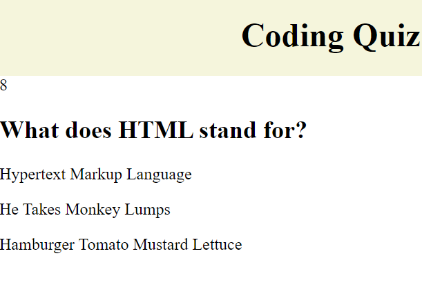
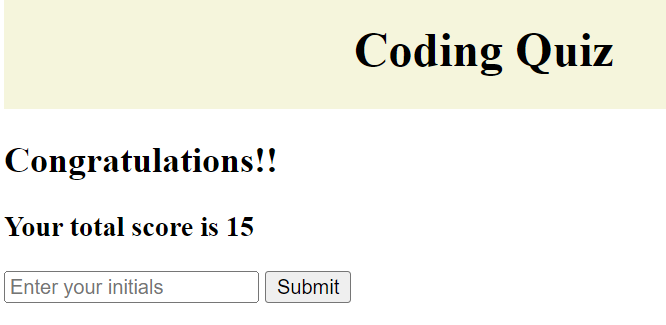
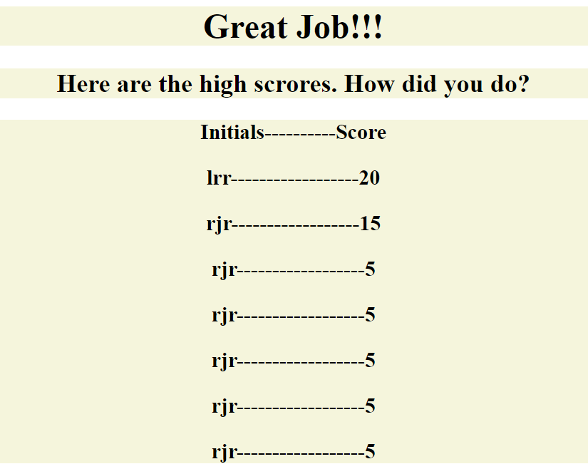

# Build a Quiz Using JavaScript

## Description
This application uses primarily JavaScript to execute a multiple choice quiz. The question and answer sets are in their own JavaScript file which is called from the main file and displayed on the HTML page. After the quiz, the user is prompted to enter their initials and submit them to the High Scores page.

## Link to Live Page
[Live Link](https://rosethorn10.github.io/coding-quiz/)
## Screenshots

